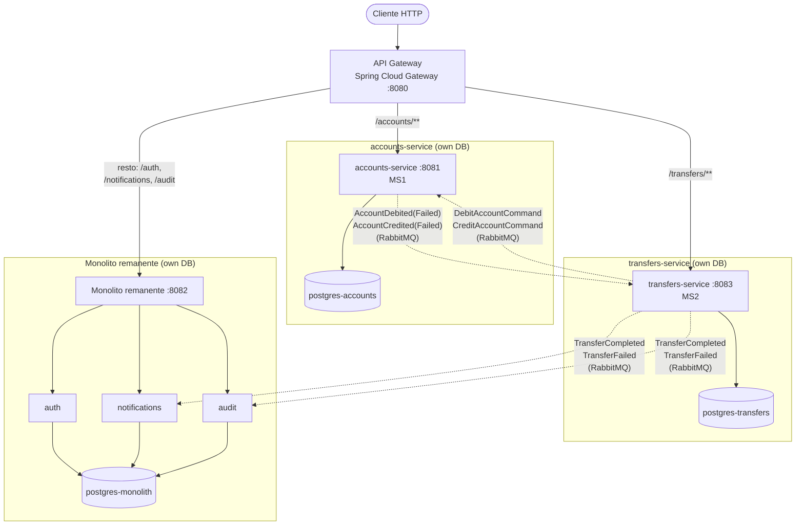

# FinBank — de monolito modular a microservicios

Reto de modernización progresiva (Strangler Fig) de un monolito modular bancario en Java/Spring Boot hacia microservicios. Este README cubre el estado tras el **Paso 5 (reto completo)**: primera extracción (`accounts`, Paso 1) + segunda extracción (`transfers`, Paso 2) comunicándose de forma asíncrona vía RabbitMQ, + contrato de eventos formal y patrones de resiliencia (Paso 3) + API Gateway, + observabilidad y trazabilidad distribuida de punta a punta (Paso 4), + documento ADR consolidado con las 11 decisiones de arquitectura y su análisis de trade-offs (Paso 5).

## Estructura del repositorio

```
services/
  monolith/           # monolito remanente: auth, notifications, audit
  accounts-service/   # microservicio extraído en el Paso 1 (MS1), con su propia base de datos
  transfers-service/  # microservicio extraído en el Paso 2 (MS2), orquesta la Saga debit/credit vía RabbitMQ
  gateway/            # Spring Cloud Gateway — único punto de entrada público
docs/
  adr/                # Architectural Decision Records (numeración global ADR-001 a ADR-011, todos los pasos)
  contracts/          # Contratos de eventos formales (JSON Schema): envelope + uno por eventType (Paso 3)
  evidencia/
    paso-1/           # evidencia del Paso 1
    paso-2/           # evidencia del Paso 2
    paso-3/           # evidencia del Paso 3
    paso-4/           # evidencia del Paso 4 — observabilidad y trazabilidad distribuida
    paso-5/           # evidencia del Paso 5 — documento ADR consolidado + análisis de trade-offs
observability/
  prometheus/         # scrape config + reglas de alerta (Paso 4)
  tempo/               # config de Grafana Tempo, backend de trazas (Paso 4)
  loki/, promtail/     # backend de logs estructurados + agente de recolección (Paso 4)
  grafana/provisioning/ # datasources + dashboard de métricas, cargados automáticamente (Paso 4)
  rabbitmq/            # config del plugin rabbitmq_prometheus (Paso 4)
```

Cada servicio es un proyecto Maven independiente (`pom.xml` propio, `Dockerfile` propio) — deployables separados, sin reactor Maven compartido.

## Ejecutar el sistema completo

```bash
docker-compose up -d --build
```

Esto levanta 13 contenedores: los 8 del Paso 3 (`postgres-monolith`, `postgres-accounts`, `postgres-transfers`, `rabbitmq`, `monolith`, `accounts-service`, `transfers-service`, `gateway`) más 5 del stack de observabilidad del Paso 4 (`tempo`, `prometheus`, `loki`, `promtail`, `grafana`). El único puerto pensado para tráfico externo de negocio es el del gateway; los de observabilidad son para consulta humana:

| Componente | Puerto | Uso |
|---|---|---|
| `gateway` | `8080` | **Punto de entrada público** — todos los clientes deben usar este puerto |
| `monolith` | `8082` | Expuesto solo para debug directo, saltándose el gateway |
| `accounts-service` | `8081` | Expuesto solo para debug directo, saltándose el gateway |
| `transfers-service` | `8083` | Expuesto solo para debug directo, saltándose el gateway |
| `rabbitmq` | `5672` (AMQP), `15672` (consola de administración), `15692` (métricas Prometheus) | Broker asíncrono entre `transfers-service`, `accounts-service` y el monolito remanente |
| `grafana` | `3000` | UI de observabilidad (logs/métricas/trazas correlacionados) — acceso anónimo habilitado, sin login |
| `prometheus` | `9090` | Métricas + reglas de alerta (Paso 4) |
| `tempo` | `3200` (API/UI), `4318` (recepción OTLP) | Backend de trazas distribuidas (Paso 4) |
| `loki` | `3100` | Backend de logs estructurados (Paso 4) |

## Cómo probar cada paso

Cada paso agrega su propia sección aquí, con el mínimo de comandos para reproducir la evidencia (el detalle completo, con las salidas reales capturadas, vive en `docs/evidencia/paso-N/`).

### Paso 1 — Strangler Fig (`accounts`) + Gateway

Con el sistema levantado, todo se prueba contra el gateway (`localhost:8080`).

**Opción simple (sin terminal):** Swagger UI en **http://localhost:8080/swagger-ui.html** agrega los specs de `accounts-service`, `transfers-service` y del monolito. Hacé `/auth/login`, copiá el `accessToken` de la respuesta, dale a "Authorize" con ese valor, y probá cada endpoint con "Try it out".

**Desde la terminal:**

```bash
extract() { grep -o "\"$1\":\"[^\"]*" | cut -d'"' -f4; }

# 1. Registrar y loguear un usuario (ruta /auth/** -> monolito)
curl -s -X POST localhost:8080/auth/register -H "Content-Type: application/json" \
  -d '{"email":"alice@example.com","password":"Password123!","name":"Alice"}' > /dev/null

TOKEN_A=$(curl -s -X POST localhost:8080/auth/login -H "Content-Type: application/json" \
  -d '{"email":"alice@example.com","password":"Password123!"}' | extract accessToken)

# 2. Crear una cuenta (ruta /accounts/** -> accounts-service, el módulo extraído en el Paso 1)
ACC_A=$(curl -s -X POST localhost:8080/accounts -H "Authorization: Bearer $TOKEN_A" | extract id)

# 3. Verificar: mismo contrato que tenía el módulo accounts dentro del monolito
curl -s localhost:8080/accounts/$ACC_A/balance -H "Authorization: Bearer $TOKEN_A"   # esperado: {"amount":"0.0000"}
```

Si el paso 3 responde con el balance esperado, el Strangler Fig y el ruteo del gateway hacia `accounts-service` quedan probados. Detalle completo (salidas reales, tabla de contenedores, config de rutas, estrategia de migración de datos) en [`docs/evidencia/paso-1/`](docs/evidencia/paso-1/).

> El Paso 1 original financiaba la cuenta y probaba una transferencia síncrona contra el monolito. Desde el Paso 2, `transfers` vive en su propio microservicio y la comunicación con `accounts-service` es asíncrona — la prueba de transferencia (financiación incluida) está en la sección del Paso 2, abajo.

### Paso 2 — Segunda extracción (`transfers`) + comunicación asíncrona vía RabbitMQ

`transfers-service` (MS2) ya no expone ni consume ningún endpoint HTTP síncrono hacia `accounts-service` (MS1) — el débito y el crédito se resuelven con una Saga orquestada sobre RabbitMQ (ver [ADR-007](docs/adr/ADR-007-patron-consistencia-distribuida.md)). Como consecuencia, `POST /transfers` ya no devuelve el resultado final: responde `202 Accepted` con la transferencia en estado `PENDING`, y el resultado se consulta con `GET /transfers/{id}`.

**Opción simple (sin terminal):** mismo Swagger UI del Paso 1 — `transfers-service` ya está agregado ahí.

**Desde la terminal:**

```bash
extract() { grep -o "\"$1\":\"[^\"]*" | cut -d'"' -f4; }

# 1. Registrar y loguear dos usuarios (Alice le va a transferir a Bob)
curl -s -X POST localhost:8080/auth/register -H "Content-Type: application/json" \
  -d '{"email":"alice@example.com","password":"Password123!","name":"Alice"}' > /dev/null
curl -s -X POST localhost:8080/auth/register -H "Content-Type: application/json" \
  -d '{"email":"bob@example.com","password":"Password123!","name":"Bob"}' > /dev/null

TOKEN_A=$(curl -s -X POST localhost:8080/auth/login -H "Content-Type: application/json" \
  -d '{"email":"alice@example.com","password":"Password123!"}' | extract accessToken)
TOKEN_B=$(curl -s -X POST localhost:8080/auth/login -H "Content-Type: application/json" \
  -d '{"email":"bob@example.com","password":"Password123!"}' | extract accessToken)

# 2. Crear una cuenta por usuario
ACC_A=$(curl -s -X POST localhost:8080/accounts -H "Authorization: Bearer $TOKEN_A" | extract id)
ACC_B=$(curl -s -X POST localhost:8080/accounts -H "Authorization: Bearer $TOKEN_B" | extract id)

# 3. Fondear la cuenta de Alice. Como ya no existe un endpoint HTTP interno de crédito
#    (ver ADR-002), esto se hace publicando el comando directamente en RabbitMQ —
#    envuelto en el EventEnvelope formal del Paso 3 (ver ADR-010) — vía la consola de
#    administración (http://localhost:15672, guest/guest) o su API:
ALICE_USER_ID=$(echo "$TOKEN_A" | cut -d. -f2 | base64 -d 2>/dev/null | grep -o '"sub":"[^"]*' | cut -d'"' -f4)
SEED_ID="$(openssl rand -hex 4)-$(openssl rand -hex 2)-$(openssl rand -hex 2)-$(openssl rand -hex 2)-$(openssl rand -hex 6)"
SEED_EVENT_ID="$(openssl rand -hex 4)-$(openssl rand -hex 2)-$(openssl rand -hex 2)-$(openssl rand -hex 2)-$(openssl rand -hex 6)"
cat > /tmp/seed_publish.json <<EOF
{
  "properties": {"content_type": "application/json", "headers": {"__TypeId__": "EventEnvelope"}},
  "routing_key": "account.credit",
  "payload_encoding": "string",
  "payload": "{\"eventId\":\"$SEED_EVENT_ID\",\"eventType\":\"CreditAccountCommand\",\"eventVersion\":\"1.0\",\"occurredAt\":\"2026-08-01T00:00:00Z\",\"producer\":\"transfers-service\",\"data\":{\"transferId\":\"$SEED_ID\",\"accountId\":\"$ACC_A\",\"userId\":\"$ALICE_USER_ID\",\"amount\":1000.00,\"reference\":\"seed\",\"purpose\":\"FORWARD\"}}"
}
EOF
curl -s -u guest:guest -X POST http://localhost:15672/api/exchanges/%2f/accounts.commands/publish \
  -H "Content-Type: application/json" --data @/tmp/seed_publish.json

# 4. Alice le transfiere a Bob (ruta /transfers -> transfers-service, el módulo extraído en el Paso 2)
sleep 1
TRANSFER=$(curl -s -X POST localhost:8080/transfers -H "Authorization: Bearer $TOKEN_A" -H "Content-Type: application/json" \
  -d '{"sourceAccountId":"'$ACC_A'","targetAccountId":"'$ACC_B'","amount":"250.00","reference":"demo"}')
echo "$TRANSFER"   # esperado: {"status":"PENDING", ...}
TID=$(echo "$TRANSFER" | extract id)

# 5. Consultar el resultado asíncrono (puede tardar uno o dos segundos en llegar a COMPLETED)
sleep 2
curl -s localhost:8080/transfers/$TID -H "Authorization: Bearer $TOKEN_A"             # esperado: {"status":"COMPLETED", ...}

# 6. Verificar: balances actualizados + notificación y auditoría entregadas vía el broker
curl -s localhost:8080/accounts/$ACC_A/balance -H "Authorization: Bearer $TOKEN_A"    # esperado: {"amount":"750.0000"}
curl -s localhost:8080/accounts/$ACC_B/balance -H "Authorization: Bearer $TOKEN_B"    # esperado: {"amount":"250.0000"}
curl -s localhost:8080/notifications -H "Authorization: Bearer $TOKEN_A"             # no vacío
curl -s localhost:8080/audit -H "Authorization: Bearer $TOKEN_A"                     # no vacío
```

Si el paso 5 muestra `COMPLETED` y el paso 6 los balances/eventos correctos, la Saga orquestada y la comunicación asíncrona MS1⇄MS2⇄monolito quedan probadas de punta a punta. La evidencia completa (paso 1) — incluyendo el caso de fondos insuficientes y el de compensación automática (crédito a cuenta inexistente, con reversión del débito) — está capturada con salidas reales en [`docs/evidencia/paso-2/`](docs/evidencia/paso-2/).

### Paso 3 — Contrato de eventos formal + patrones de resiliencia

Desde este paso, todo mensaje en RabbitMQ viaja envuelto en un `EventEnvelope` versionado (`eventId`, `eventType`, `eventVersion`, `occurredAt`, `producer`, `data` — ver [ADR-010](docs/adr/ADR-010-contrato-de-eventos.md) y los schemas en [`docs/contracts/`](docs/contracts/)), y las cuatro colas de negocio (`accounts-service.commands`, `transfers-service.account-events`, `monolith.notifications.transfer-events`, `monolith.audit.transfer-events`) tienen **retry con backoff exponencial** (3 intentos, 500ms/1s/2s), **dead-letter queue** y **consumidor idempotente** (deduplicación por `eventId`).

Los comandos del Paso 2 de arriba ya usan el nuevo formato de envelope y siguen funcionando igual. Para ver los tres patrones de resiliencia **en acción** (incluyendo una caída real y controlada de `postgres-accounts` en medio de una transferencia, con reintentos, caída a la DLQ, recuperación por replay, y una entrega duplicada correctamente ignorada), no hay un script corto que lo reproduzca de forma segura — la secuencia completa con logs y salidas reales está documentada paso a paso en [`docs/evidencia/paso-3/03-patrones-resiliencia.md`](docs/evidencia/paso-3/03-patrones-resiliencia.md).

### Paso 4 — Observabilidad y trazabilidad distribuida

Los cuatro componentes (gateway, ambos microservicios y el monolito remanente) ahora emiten los tres pilares de observabilidad (ver [ADR-009](docs/adr/ADR-009-stack-observabilidad.md)): logs JSON estructurados, métricas Prometheus y trazas distribuidas con un único `TraceId` propagado de punta a punta — incluyendo a través de los mensajes de RabbitMQ.

Con el sistema levantado, hacé cualquier transferencia igual que en el Paso 2/3 y luego:

```bash
# 1. Ver la traza completa de esa operación en Tempo (usá el traceId de la respuesta HTTP,
#    header `traceparent`, o buscalo en los logs de cualquiera de los 4 servicios)
curl -s "http://localhost:3200/api/traces/$TRACE_ID"

# 2. Ver los mismos logs correlacionados por traceId en cada servicio
docker compose logs transfers-service accounts-service monolith --since 2m | grep "$TRACE_ID"

# 3. Ver las métricas (P99 por servicio, tasa de errores, consumer lag de RabbitMQ)
open http://localhost:3000   # dashboard "FinBank — Overview (Paso 4)", provisionado automáticamente
```

Evidencia completa, con salidas reales (spans capturados, líneas de log, resultados de Prometheus) en [`docs/evidencia/paso-4/`](docs/evidencia/paso-4/).

### Paso 5 — Documentación de Decisiones de Arquitectura (ADR)

Cierre del reto: un único documento consolida las **11 decisiones arquitectónicas** tomadas en los pasos 1-5 (ADR-001 a ADR-011, incluyendo la estrategia de migración de datos formalizada como ADR-011), en el formato exigido (Título, Estado, Contexto, Opciones evaluadas, Decisión, Consecuencias), seguido de un análisis de trade-offs que responde explícitamente cuándo la consistencia eventual es aceptable en un dominio bancario, qué operaciones sacrificaron disponibilidad, qué tan reversible es cada decisión, si la complejidad operativa está justificada para la carga actual de FinBank, y qué módulos se consideró no extraer.

Documento completo: [`docs/evidencia/paso-5/01-documento-adr-consolidado.md`](docs/evidencia/paso-5/01-documento-adr-consolidado.md).

## Arquitectura tras el Paso 2



Diagrama de secuencia completo de la Saga (camino feliz, fallo temprano y compensación) en [`docs/evidencia/paso-2/05-patron-consistencia-distribuida.md`](docs/evidencia/paso-2/05-patron-consistencia-distribuida.md).

### Contrato HTTP externo

| Ruta | Servido por | Notas |
|---|---|---|
| `GET/POST /accounts`, `GET /accounts/{id}/balance` | `accounts-service` (MS1) | Sin cambios desde el Paso 1 |
| `POST /transfers`, `GET /transfers`, `GET /transfers/{id}` | `transfers-service` (MS2) | `POST /transfers` responde `202 Accepted`/`PENDING` desde el Paso 2 (antes `201 Created` con resultado inmediato); `GET /transfers/{id}` es nuevo |
| `POST /auth/**`, `GET /notifications`, `GET /audit` | Monolito remanente | Sin cambios; `notifications`/`audit` ahora reaccionan a eventos del broker |

### Contrato interno (no expuesto por el gateway, solo RabbitMQ)

El endpoint interno síncrono del Paso 1 (`POST /internal/accounts/{id}/debit|credit`) se eliminó. Toda la comunicación entre `transfers-service` y `accounts-service` ocurre ahora vía RabbitMQ: `accounts.commands` (comandos débito/crédito) y `accounts.events` (resultado). `transfers-service` publica además `transfer.completed`/`transfer.failed` en `transfers.events`, consumido por `notifications` y `audit` en el monolito remanente. Ver [`docs/evidencia/paso-2/04-diagrama-arquitectura-final.md`](docs/evidencia/paso-2/04-diagrama-arquitectura-final.md) para el detalle de exchanges/colas/routing keys.

Ver [ADR-001](docs/adr/ADR-001-eleccion-primer-modulo-a-extraer.md) / [ADR-002](docs/adr/ADR-002-eleccion-segundo-modulo-a-extraer.md) para la justificación de por qué `accounts` y `transfers` fueron los módulos extraídos, y [docs/evidencia/paso-1/05-estrategia-migracion-datos.md](docs/evidencia/paso-1/05-estrategia-migracion-datos.md) para la estrategia de migración de datos sin downtime.

## Evidencia por paso

- [`docs/evidencia/paso-1/`](docs/evidencia/paso-1/) — justificación, microservicio funcionando, gateway enrutando, diagrama y estrategia de migración del Paso 1.
- [`docs/evidencia/paso-2/`](docs/evidencia/paso-2/) — justificación del segundo módulo, `transfers-service` funcionando, comunicación asíncrona vía RabbitMQ (camino feliz, fondos insuficientes, compensación), diagrama de arquitectura final y patrón de consistencia distribuida.
- [`docs/evidencia/paso-3/`](docs/evidencia/paso-3/) — arquitectura de eventos documentada, diagrama de secuencia (happy path y failure path), demostración funcional de retry+backoff/DLQ/consumidor idempotente, y prueba de que el monolito remanente reacciona correctamente vía broker.
- [`docs/evidencia/paso-4/`](docs/evidencia/paso-4/) — trace completo de una operación con spans en los cuatro componentes, mismo TraceId correlacionado en los logs de todos los servicios, y dashboard de métricas (P99 por servicio, tasa de errores, consumer lag de RabbitMQ).
- [`docs/evidencia/paso-5/`](docs/evidencia/paso-5/) — documento ADR consolidado (ADR-001 a ADR-011 en un solo archivo) y análisis de trade-offs de arquitectura de todo el reto.

## Decisiones de arquitectura (ADR)

| ADR | Decisión |
|---|---|
| [ADR-001](docs/adr/ADR-001-eleccion-primer-modulo-a-extraer.md) | Elección de `accounts` como primer módulo a extraer |
| [ADR-002](docs/adr/ADR-002-eleccion-segundo-modulo-a-extraer.md) | Elección de `transfers` como segundo módulo a extraer |
| [ADR-003](docs/adr/ADR-003-api-gateway.md) | Spring Cloud Gateway como API Gateway |
| [ADR-004](docs/adr/ADR-004-message-broker.md) | RabbitMQ como message broker MS1⇄MS2⇄monolito |
| [ADR-005](docs/adr/ADR-005-base-datos-accounts-service.md) | PostgreSQL dedicado para `accounts-service` |
| [ADR-006](docs/adr/ADR-006-base-datos-transfers-service.md) | PostgreSQL dedicado para `transfers-service` |
| [ADR-007](docs/adr/ADR-007-patron-consistencia-distribuida.md) | Saga orquestada con compensación para debit/credit |
| [ADR-008](docs/adr/ADR-008-arquitectura-interna-microservicios.md) | Arquitectura interna: hexagonal en `transfers-service`, capas en `accounts-service`/monolito |
| [ADR-009](docs/adr/ADR-009-stack-observabilidad.md) | Stack de observabilidad: Micrometer Tracing + OTel, Grafana Tempo, Prometheus+Grafana, Loki+Promtail |
| [ADR-010](docs/adr/ADR-010-contrato-de-eventos.md) | Contrato de eventos: envelope propio versionado, inspirado en CloudEvents |
| [ADR-011](docs/adr/ADR-011-estrategia-migracion-de-datos.md) | Estrategia de migración de datos de los schemas: patrón expand → migrate → contract, sin downtime |

El documento ADR consolidado con las 11 decisiones del reto completo, más el análisis de trade-offs de arquitectura, vive en [`docs/evidencia/paso-5/01-documento-adr-consolidado.md`](docs/evidencia/paso-5/01-documento-adr-consolidado.md).

## Documentación por servicio

- [`services/monolith/README.md`](services/monolith/README.md) — módulos remanentes, capas internas, ejecución standalone.
- `services/accounts-service`, `services/transfers-service` y `services/gateway` no tienen lógica de negocio adicional que documentar más allá de este README y sus ADRs.
