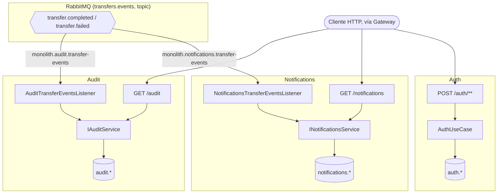
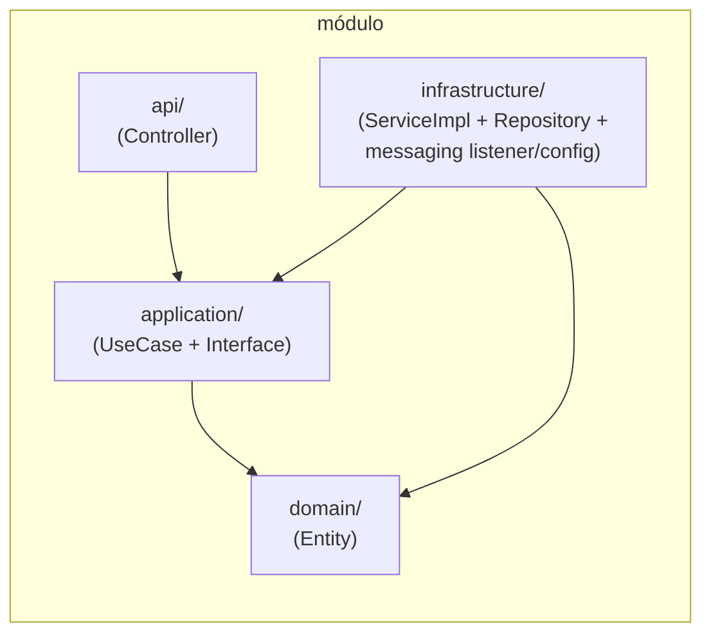
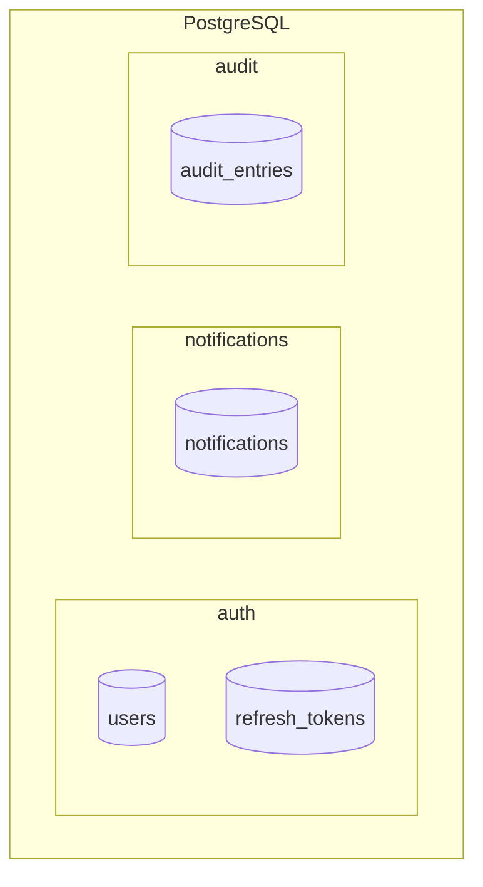

# modular-bank-java — monolito remanente

Monolito modular bancario implementado en Java / Spring Boot 3. El módulo `accounts` fue extraído a un microservicio independiente en el Paso 1 (`services/accounts-service`), y el módulo `transfers` fue extraído en el Paso 2 (`services/transfers-service`) — ver el [README raíz](../../README.md) para la arquitectura completa del sistema y los ADR.

## Requisitos
- Java 17+
- Maven 3.9+
- Docker

## Ejecutar de forma standalone (solo este servicio)

```bash
docker-compose up -d   # levanta únicamente postgres-monolith
mvn spring-boot:run
```

> Para levantar el sistema completo (gateway + accounts-service + transfers-service + RabbitMQ + monolito), usa el `docker-compose.yml` de la raíz del repositorio en su lugar.

Variable de entorno relevante: `RABBITMQ_HOST` (por defecto `localhost`) — sin un broker accesible, `notifications` y `audit` no reciben los eventos de transferencia (ver más abajo).

## Módulos

| Módulo | Schema | Interfaz pública |
|---|---|---|
| auth | auth.* | — (solo JWT) |
| notifications | notifications.* | NotificationsService |
| audit | audit.* | AuditService |

`accounts` y `transfers` ya no viven aquí. `notifications` y `audit` ya no son invocados in-process por un caso de uso de transferencias local (ese caso de uso — `TransferUseCase` — se extrajo junto con `transfers` en el Paso 2, ver [ADR-002](../../docs/adr/ADR-002-eleccion-segundo-modulo-a-extraer.md)): ahora reaccionan a los eventos `transfer.completed`/`transfer.failed` publicados por `transfers-service` en RabbitMQ, cada uno con su propia cola independiente (`monolith.notifications.transfer-events`, `monolith.audit.transfer-events`) — ver `shared/infrastructure/messaging/`.

## Arquitectura

### Cómo llegan los eventos de transferencia a los módulos remanentes



`transfers-service` (el microservicio externo) es quien produce `transfer.completed`/`transfer.failed` — el monolito remanente nunca inicia esa conversación, solo la consume.

### Capas internas de cada módulo



Esta es la misma convención de capas del Paso 1 (ver [ADR-008](../../docs/adr/ADR-008-arquitectura-interna-microservicios.md) para por qué el monolito y `accounts-service` mantienen capas simples mientras `transfers-service` adopta arquitectura hexagonal explícita): los listeners de RabbitMQ (`NotificationsTransferEventsListener`, `AuditTransferEventsListener`) viven en `shared/infrastructure/messaging/` y llaman a las mismas interfaces de `application/` que ya usaban los controllers HTTP — ningún módulo de negocio sabe que ahora lo invoca un mensaje de broker en vez de una llamada in-process.

### Aislamiento de schemas en PostgreSQL (`postgres-monolith`)



`accounts.accounts` (Paso 1) y `transfers.transfers` (Paso 2) ya no existen en esta base de datos — se migraron a sus propias instancias (`postgres-accounts`, `postgres-transfers`) y los schemas locales se eliminan en `V7__drop_accounts_local_schema.sql` y `V8__drop_transfers_local_schema.sql` respectivamente (ver [estrategia de migración](../../docs/evidencia/paso-1/05-estrategia-migracion-datos.md)).
